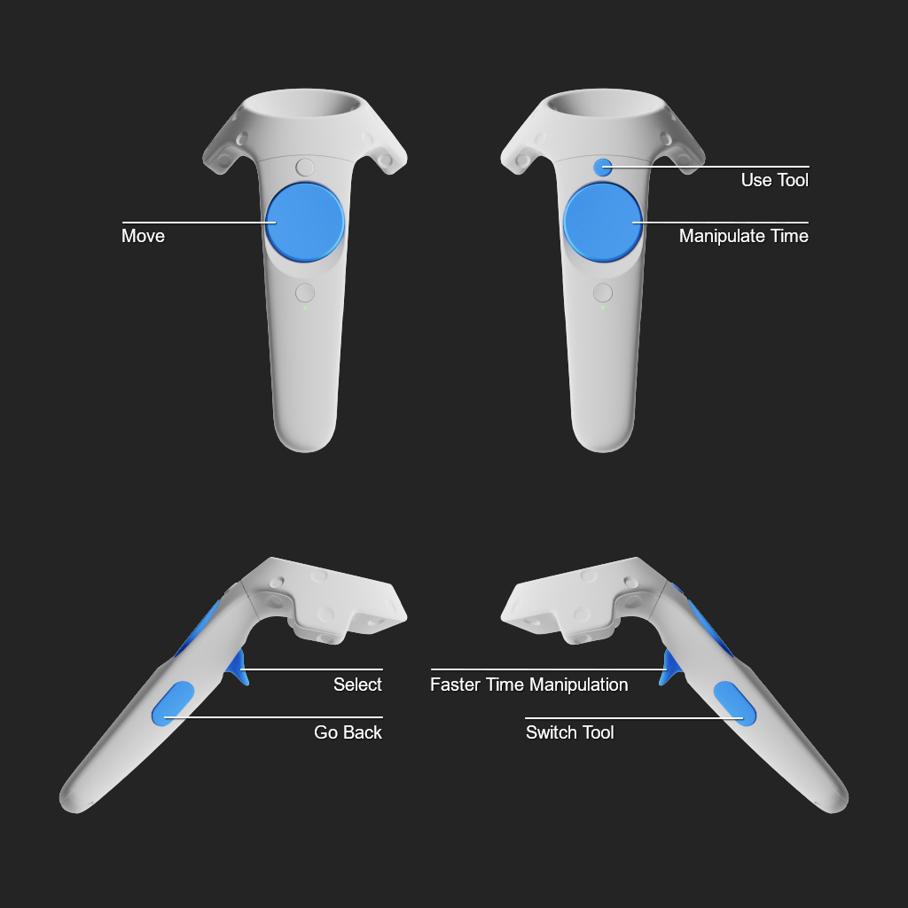

# SolarSystemExplorer
A small Unity project that allows users to explore the **Solar System** in VR.

## How to use
Open the repository folder as a project with [**Unity 2022.3.4f**](https://unity.com/releases/editor/whats-new/2022.3.4) or later.  
In the content browser navigate to **'Assets/Scenes'** and open **'SolarSystemScene'**.  
Now press play.

## Controls

- Move: Continuous Movement
- Select:
    - Teleport to the celestial body the controller is currently pointing at
    - Interact with UI and other points of interest
- Go Back: Return to view of the entiere solar system
- Manipulate Time:
    - Move finger clockwise: Go forward in time
    - Move finger counterclockwise: Go back in time
    - Click: Pause/Unpause time
- Faster Time Manipulation: Switch from one day per rotation to one year per rotation
- Switch Tool: Cycle through available tools
- Use Tool: use the currently selected tool

## Tools
The right hand is reserved for tools. The available tools can be cycled through by pressing the **Switch Tool Button**.  
Tools are used to extract certain kinds of information from the currently visited celstial body.  
Currently these tools include:

### Thermometer
Measure the **Average Surface Temparature** by poking a celestial body and pressing the **Use Button**.

### Chemical Flask
Extract the **Atmospheric Composition** by poking a celestial body and pressing the **Use Button**.

### Magnifying Glass
Hide or reveal **Points of Interest** around a celestial body by pressing the **Use Button**.

### Ruler
Measure the **Equatorial Radius** of a celestial body by pressing the **Use Button**.

### Calendar
Displays the **Current Simulation Time** as well as the **Speed** with wich time is currently moving.  
This **Time Speed** can be manipulated by pressing the **Use Button**:
- Single press: speed up time
- Double press: slow down time

## Dependencies
**Solar System Explorer** has no dependencies apart from Unity and the Unity-Packages used by this project.

## Sources
- **Textures for Planets and Moons** are adapted from openly available surface scans offered by **NASA**.
- **Textures for the Sun** are custom made.
- **All meshes for all celestial bodys and tools** are custom made.
- The realtime rendering of **Atmospheric Scattering and Absorption Events** is based on this
 [Precomputed Atmospheric Scattering](https://inria.hal.science/inria-00288758/en) paper.
- The **ephemeris calculations** for planets are based on [VSOP87](https://github.com/ctdk/vsop87), a widely used approximation for planetary orbits and their pertubations due to other celestial bodys.
- The **rotational model** used for Earths rotation is based on this [P03 long period precession theory](https://www.aanda.org/articles/aa/abs/2005/10/aa1908/aa1908.html) paper.
- Other celestial bodys use less accurate **IAU Rotational Models** or simple **Precessing Models** with constant rates of precession and rotation.
- **All text and all images** shown as part of the UI, as well as all information retrievable through tools were taken from NASA's [Solar System Exploration](https://solarsystem.nasa.gov/) website.